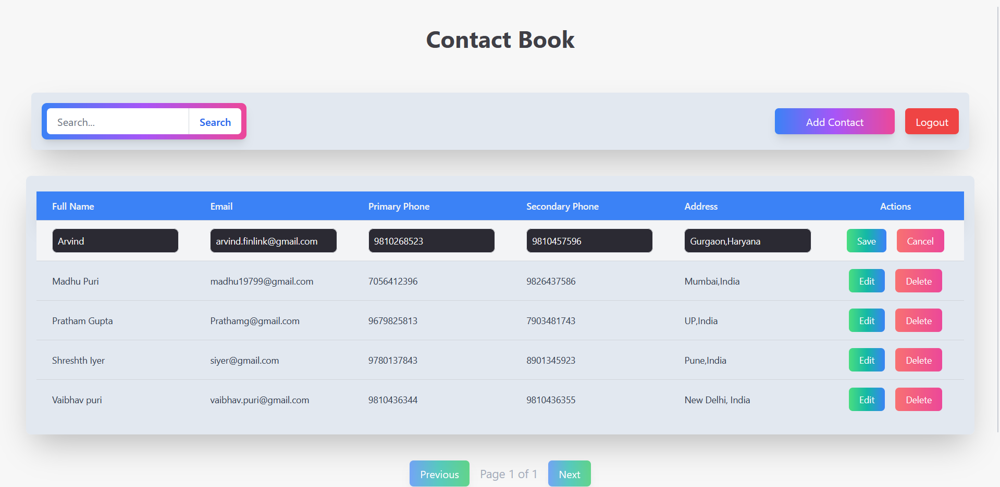

# Contact Book Application

This is a contact_book application made using react.js, node.js and mysql.

## Features

- **CRUD Operations**: Perform create, read, update, and delete actions directly within the table.
- **Pagination**: Split items into multiple pages for more convenient navigation.
- **Sorting**: The table is initially sorted by `fullname`.

## Frontend UI

Home page  

Contact Form  

Edit Contact  

Register

Login

 Install Dependencies for Both Backend and Frontend

###  Backend (Node.js)
Navigate to the backend folder and install dependencies:
cd backend
npm install

## Frontend (React)
In a separate terminal window, navigate to the frontend folder and install dependencies:
cd frontend
npm install

## Running the Application
1. Start the Backend Server
In the backend directory,
Create a .env file which will contain your data keys(
DB_HOST,
DB_USER,
DB_PASSWORD,
DB_NAME,
JWT_SECRET
)
Then
start the Node.js server. This server provides the API for the CRUD operations.

Run the backend using ("node server.js")

The backend will run on http://localhost:8080 (or the port specified in your configuration).

1. Start the Frontend Development Server
In the frontend directory, start the React development server.

Run the frontend using ("npm run dev")
The frontend will run on http://localhost:5173 by default.

**Usage**  
- **Add Items**: Click the "Add" button to create a new entry in the table. 

- **Edit Items**: Select a contact to modify its details and then save the changes.

- **Delete Items**: Press the "Delete" button next to an item to remove it.  

- **Search**: Use the search bar to find specific contacts.  

**License**

